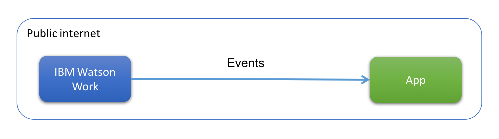
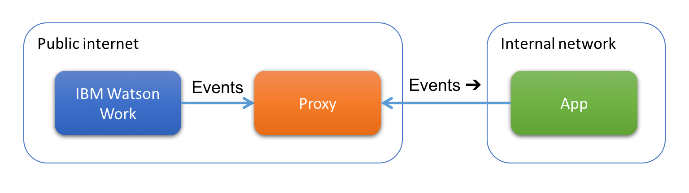

# Watson Work Webhook Proxy

[](https://greenkeeper.io/)

This is a proxy that allows accessing webhook events without a need of exposing public internet URL by the app.

## Basics
Webhooks require app to open up a URL that events are delivered to.


The proxy is a small app that listens to events, temporarily stores them and allows app to retrieve them.


Events can be retrieved in two ways
1. JSON REST 
An app may periodically call the proxy and retrieve all the stored events.

2. Websocket
An app may initiate a persistent connection to the proxy and get all the stored events as well as new ones in real time trough that connection.

## Operation
You can deploy the app yourself or use a version deployed already on bluemix under `https://watsonwork-webhook-proxy.mybluemix.net/`.

All APIs require regular IBM Watson Work authentication token, that is
```
Authorization: Bearer <access_token>
```
for the app. Proxy verifies the token by calling Watson Work APIs and comparing appId in the API call with the identity of the token.

### PUT /webhooks/:appId
Payload: `{"secret": "<webhook-secret>"}`.

This API registers a new webhook in the proxy for a given appId. The proxy accepts webhook events only for registered apps. It also authenticates incoming events by verifying the signature using the webhook secret provided.

### DELETE /webhooks/:appId
Removes webhook registration.

### GET /webhooks/:appId
This API retrieves all stored webhook events for given app. After events are returned they are no longer stored by the proxy. You can call this API periodically to retrieve new events.

### Websocket interface
Websocket interface is provided at `wss://<hostname>/webhooks/:appId`

The proxy will send websocket messages with a following structure:
```
{ 
  type: 'event',
  id: '<eventId>',
  data: <webhook event> 
}
```
A separate message is sent for every event. When app connects, the proxy will send all the events already stored and then new events that are delivered.

The app must respond to accept every event it received using following message:
```
{ 
  type: 'event_ack',
  id: '<eventId>' 
}
```
The event id in accept message mush match the received event.

### /hook/:appId
This is the interface to receive webhooks from IBM Watson Work. App does not call that API.

## Setup your app
App can be set up to use the app to use the proxy in the following way.

1. Create webhook for the app, and specify proxy `/hook/:appId` URL as a webhook endpoint. For example `https://watsonwork-webhook-proxy.mybluemix.net/hook/8eecdc5d-1222-40db-80f7-56dff9b0439c`. Remember to record your webhook secret.

2. Register the webhook in the proxy by calling `PUT /webnooks/:appId` API. For example `https://watsonwork-webhook-proxy.mybluemix.net/webhooks/8eecdc5d-1222-40db-80f7-56dff9b0439c` and your webhook secret in the payload.

3. Enable the webhook.

## Examples
This repository provides a few basic examples. The websocket client is located under `src/client.js` and is built with the rest of the proxy.

There are three simple shell scripts that use httpie HTTP client (just like curl), and jq JSON parser.
The scripts require two environment variables `APPID` for the appId and `SECRET` for the app secret (note, this is app secret, not the webhook secret).

- `examples/register.sh WEBHOOK_SECRET`: register the app
- `examples/get.sh`: get stored webhook events using the REST API
- `examples/listen.sh`: run sample websocket client